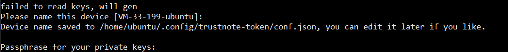
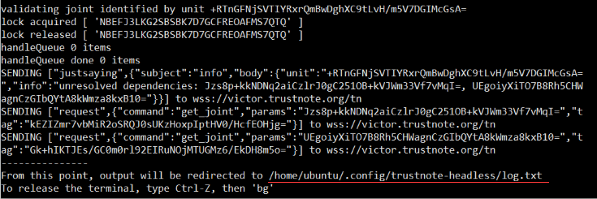
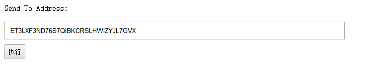

在TrustNote 公链上发行Token
===============================

以下教程在Ubuntu 16.04、OSX 10.13 上测试通过，根据以下操作指引，开发者可以快速地在TrustNote测试链上发行自己的Token。
<!-- //NODE.JS ENV  -->
<!-- // VERSION  -->

### 安装 Node.js 8:

Ubuntu

```bash
curl -sL https://deb.nodesource.com/setup_8.x | sudo -E bash -
sudo apt-get install -y nodejs
```
OSX 可以到 https://nodejs.org/en/ 直接下载pkg文件进行安装

查看Node.js 版本号
```bash
node -v
```
如果可以看到版本号，则代表Node.js已经安装成功。


### 下载示例代码

```bash
git clone https://github.com/llcds/trustnote-token.git
```
### 安装 node 依赖包
```bash
cd trustnote-token
npm install
```
这会花费一些时间，需要耐心等待。`npm install` 成功后可以看到命令行如下提示:


由于网络原因，运行`npm install `可能会耗费非常长的时间，有时候甚至会安装失败。用户可以 更改npm源来解决此问题，具体操作参考 https://yq.aliyun.com/articles/5543 。


### 修改创世单元

用文本编辑器打开 `trustnote-token/node_modules/trustnote-common` 目录下的 `constants.js` 文件, 将第10行中的 `rg1RzwKwnfRHjBojGol3gZaC5w7kR++rOR6O61JRsrQ=` 替换为 `MtzrZeOHHjqVZheuLylf0DX7zhp10nBsQX5e/+cA3PQ=` 后保存。


### 启动服务同步节点

启动节点，等待数据同步
``` bash
node start.js
```
在启动节点过程中，遇到需要输入参数的地方，按Enter键默认即可


设置passphrase，直接按Enter键即可


出现如下界面时，不要关闭窗口


新开一个命令窗口，通过tail -f 日志文件地址（图片中红色下划线的部分）查看节点同步情况，节点同步时，日志刷新会比较频繁，如果日志刷新变慢，基本上代表节点同步完成，在网络良好的情况下，数据同步大概需要10~20分钟的时间。

###  领取测试TTT

在TrustNote公链上发行Token，转账都需要花费一定量的TTT，开发者需可以根据如下操作领取测试用的TTT：

1：打开 www.trustnote.org/token.html 

2：输入收款地址。（地址可以在 `address.json`文件中查看）


3：点击 `执行` 领TTT。


###    发行Token
1. 设置参数  
 用文本编辑器打开 `create_asset.js`，将第 13 行的 100000 修改为需要的发行量后保存。
2. 运行脚本  
在命令行输入 `node create_asset.js`，遇到需要输入参数的地方，按Enter键即可。   
如果发行成功，会在 `asset.json` 看到TokenId，这个TokenId就是刚才发行的Token的标识符。   
可以到 https://testexplorer.trustnote.org 测试网络浏览器输入asset地址查询到刚刚发行的Token。


###    Token转帐
 1. 设置参数  
 用文本编辑器打开 `transfer_asset.js`，将 `DJw4edxgaSbt7VGTsmsadmRdYJ+Vvz1Hrhy+JGrAyiA=` 替换成 `asset.json` 中的TokenId，也可以将转账金额更换为另外的金额，以便查看。

 2. 执行转账  
 在命令行输入 `node transfer_asset.js`，遇到需要输入参数的地方，按Enter键即可。可以到https://testexplorer.trustnote.org/#LDFEZ5TWE4XW4NUAUQHCMEPEQV7NAX6X 测试网络浏览器查看转账的情况

###    查询余额
打开测试浏览器地址，https://testexplorer.trustnote.org ，在查询框中输入`asset.json`中的TokenId 即可进行查询。


**注意：** 
1. 当前运行环境是TrustNote测试网络。
2.  测试网络浏览器地址 https://testexplorer.trustnote.org