### 一、下载钱包

到TrustNote官网下载钱包，地址为 https://trustnote.org/application.html ，为了保证安全，一定不要从其他应用市场下载。

TrustNote钱包支持Android、iOS、Windows、Mac、Linux等不同的操作系统，为了便于扫码等操作，建议使用手机钱包。

根据手机系统的不同选择下载不同的钱包，下载完安装即可。

需要注意的是，iOS安装后需要设置信任证书。

打开钱包，首先会弹出使用条款，阅读后同意即可

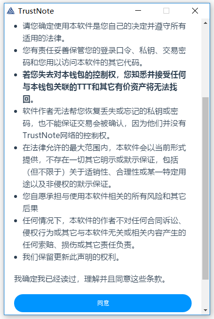

之后会选择钱包的类型，按照默认设置即可

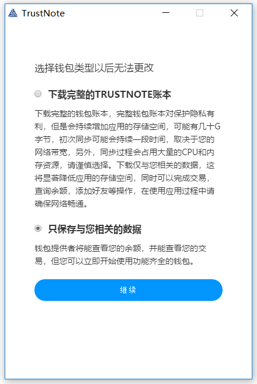

下一步是给设备命名，可以选择默认，也可以修改为你喜欢的名称

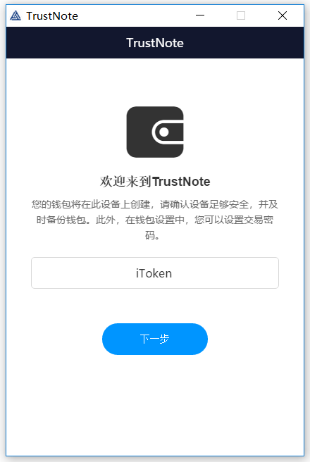

之后进入钱包创建和恢复界面，首次使用，选择创建钱包

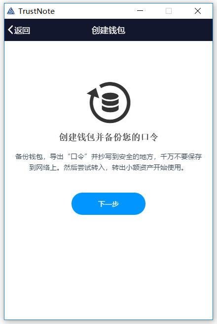

之后会生成钱包的助记词，请一定注意提示，使用手抄写助记词到物理介质上，保证钱包安全

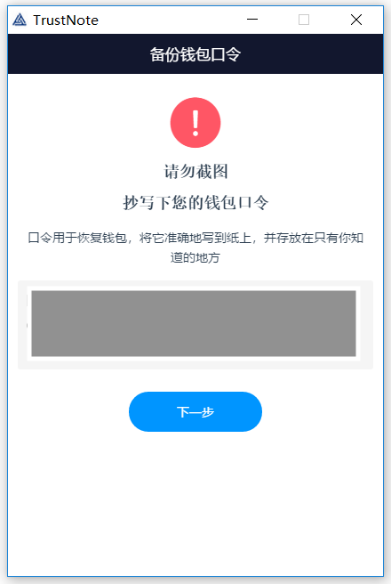

抄写完成后，为了保证你的安全，要求重新进行验证，按照刚才抄写下的助记词输入即可，验证成功后，可以直接删除口令

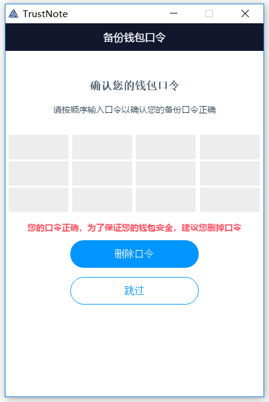
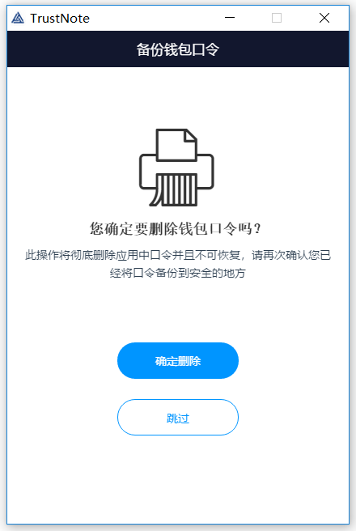

删除口令后，即可进入钱包的界面

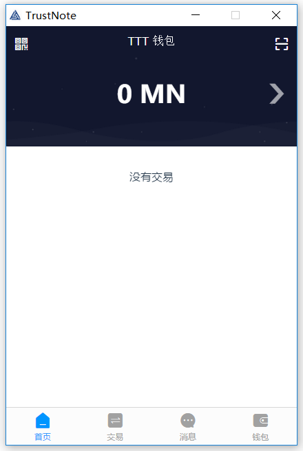

钱包左上角为钱包的收款地址，钱包的右上角是扫码，后续发行Token支付时候扫码即可

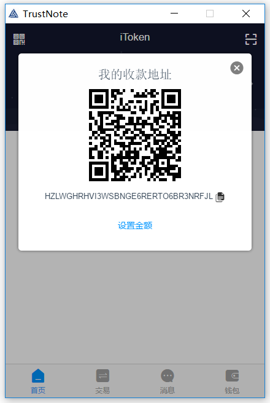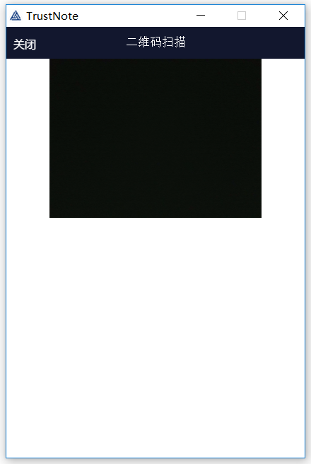

### 二、购买TTT

TTT已经在如下交易所上线，请自行选择购买

|交易所|地址|支持交易对|交易手续费|提币手续费|最小提币额度|
|-----|---|--------|---------|--------|-----------|
|Bit-Z|https://www.bit-z.com/|TTT-ETH/BTC|0.1%|50TTT|500TTT|
|coinbene|http://www.coinbene.com/|TTT-USDT|0.1%|80TTT|80TTT|
|a.mom|https://www.a.mom/|TTT-ETH|0.1%|1TTT|5TTT|

### 三、查看发行的Token

打开钱包，在顶部往右滑动即可看到新发行的Token

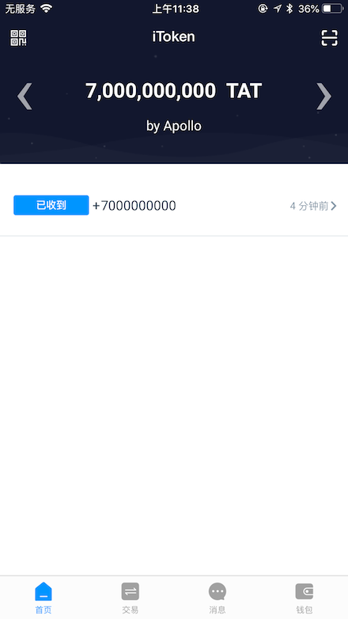

### 四、转出Token

点击底部的交易按钮，切换到交易页面，在顶部可用余额处选择新发行的Token，然后在到输入转出的地址，金额输入转出的数量，之后确定。转账需要花费的一定量的TTT。

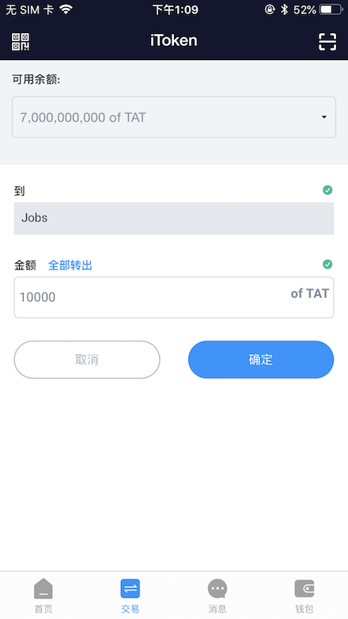
